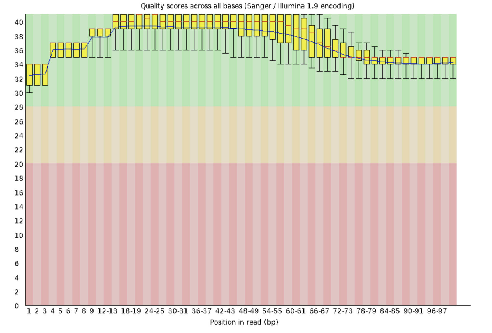
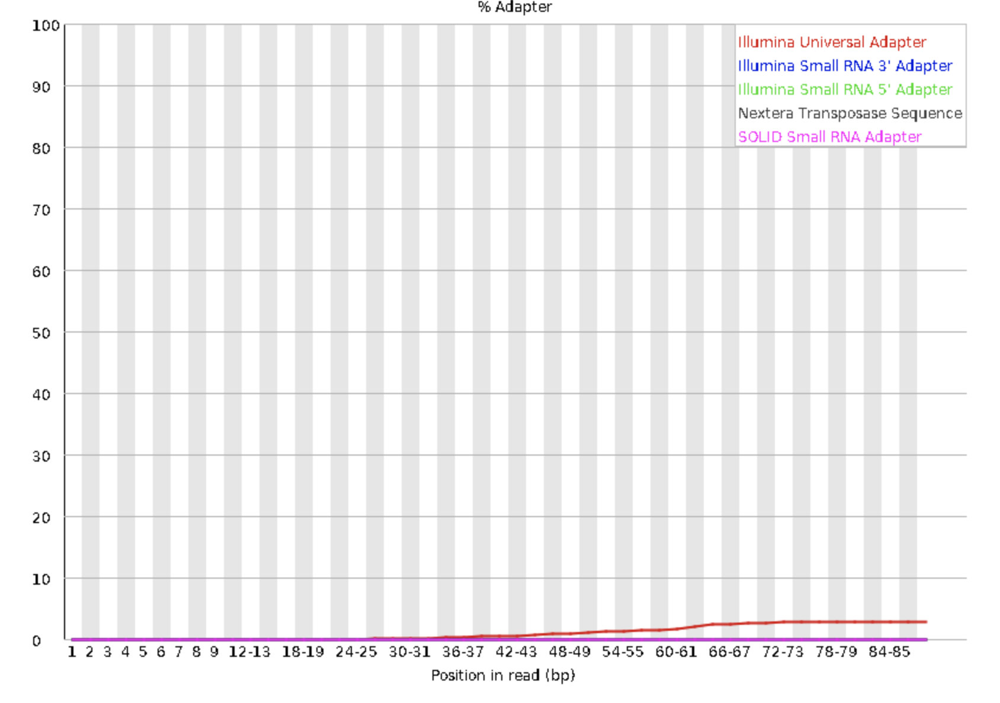
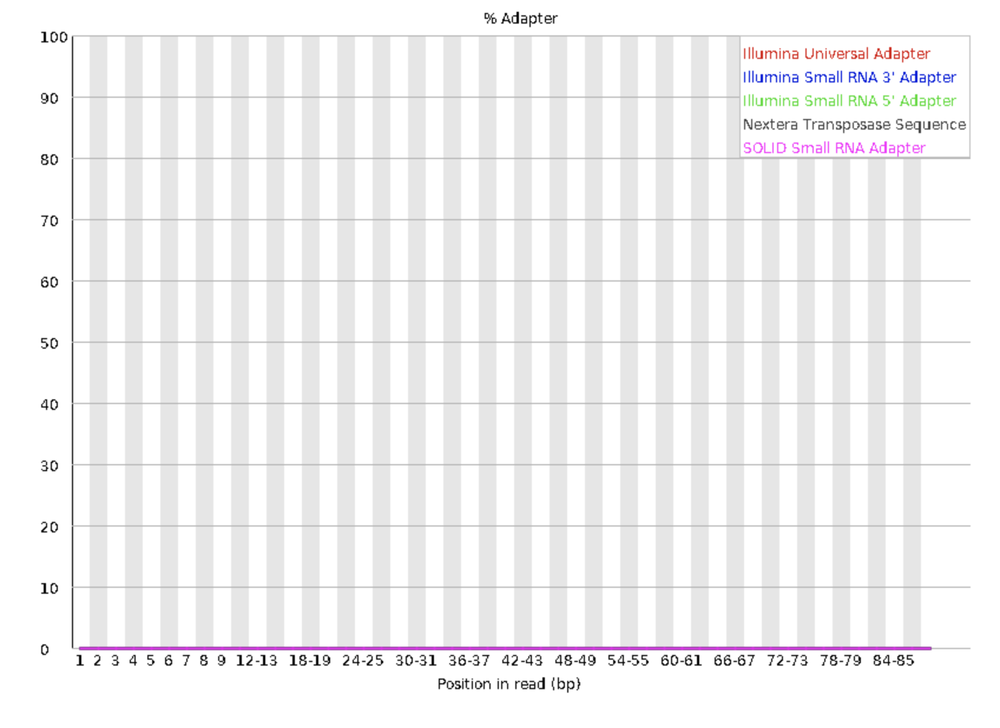

# 25 - 04 - 2019

# Transcriptome assembly

Today I'm going to start to work with the RNA data. We have both paired and single reads in two conditions:

- Serum
- BH

The ultimate goal is to compare the gene expression in this two conditions using both the assembled genome and the RNA reads.

The authors of the paper used the paired end Illumina reads to map them to the genome and obtain the transcriptome assembly. 

But firs we have to check the quality of the reads and trim them if necessary. 

For that we run `FastQC`. 

 ```bash
 fastqc Serum/*_paired_* -o /home/clno2215/stunning-garbanzo/results/transcriptomics/Serum/fastqc/

 fastqc BH/*_paired_* -o /home/clno2215/stunning-garbanzo/results/transcriptomics/BH/fastqc/
 ```

The result is on the `results` directory. Even though most reads seem to have pretty good quality I'm going to trim them anyway, just to make sure there are no other artifacts.

After that we can run `trimmomatic` on the files to check if they are really trimmed. For that I ran the following sbatch script:

```bash
#!/bin/bash -l
#SBATCH -A g2019003
#SBATCH -p core
#SBATCH -n 2
#SBATCH -t 05:00:00
#SBATCH -J trim_serum_25-04-2019
#SBATCH --mail-type=ALL
#SBATCH --mail-user c.novella.rausell@gmail.com
# Load modules
module load bioinfo-tools
module load trimmomatic
# Your commands
cd /home/clno2215/stunning-garbanzo/data/transcriptomics/RNA-seq/raw_data/Serum
bash cmd_file
```
`cmd_file` contain the trimmomatic commands needed for every file. To generate these files I ran `09_BashScript_Trim.sh` on the folder containing the reads. I manually modified some commands since the script was not working as intended. 

Once `trimmomatic` has finished, we can check if the quality of the reads has significantly increased compared to the previous available. For that we run `FastQC` again. 

```bash
#!/bin/bash -l
#SBATCH -A g2019003
#SBATCH -p core
#SBATCH -n 2
#SBATCH -t 05:00:00
#SBATCH -J fastqc_trimmed_29-04-2019
#SBATCH --mail-type=ALL
#SBATCH --mail-user c.novella.rausell@gmail.com
# Load modules
module load bioinfo-tools
module load fastqc
# Your commands
fastqc /home/clno2215/stunning-garbanzo/data/transcriptomics/RNA-seq/trimmed_data/BH/*_paired.fq* -o /home/clno2215/stunning-garbanzo/results/transcriptomics/Serum/fastqc_trimmed/

fastqc /home/clno2215/stunning-garbanzo/data/transcriptomics/RNA-seq/trimmed_data/Serum/*_paired.fq* -o /home/clno2215/stunning-garbanzo/results/transcriptomics/BH/fastqc_trimmed/
```

The results are the expected considering that we trimmed what was given as already trimmed. I'm going to include a couple of screenshots of the report given by FastQC. 

_Previous to the trimming step_
<p align="center">
    
    
</p>

_After to the trimming step_

<p align="center">
    
    
</p>

As we can see, when it comes to the average quality of the reads the game hasn't changed that much. But when it comes to the adapter content, there was still some residual adapter content on the reads that we got rid of with the trimming step. 

For the mapping of the reads to the reference genome I'm going to use the regular reads they provided us. The reason of this is because if I do it with my trimmed reads I run out of space in my disk. 

In order to do the mapping, I did the alignment with `bowtie2`. I did an alignment for every pair of forward reverse files as well as for every condition (BH and Serum). That is one alignment for ERR1797969-74. 

I'll pipe the alignment to `samtools` to convert the `.sam` into `.bam` to not run out of space. 

The corresponding bash scripts are the following:

_For the BH condition_
```bash
#!/bin/bash -l
#SBATCH -A g2019003
#SBATCH -p core
#SBATCH -n 4
#SBATCH -t 05:00:00
#SBATCH -J BWT2alignBH_30-04-2019
#SBATCH --mail-type=ALL
#SBATCH --mail-user c.novella.rausell@gmail.com
# Load modules
module load bioinfo-tools
module load bowtie2
module load samtools/1.9
# Your commands
cd /home/clno2215/stunning-garbanzo/results/transcriptomics/BH/bowtie2
bowtie2 -x /home/clno2215/stunning-garbanzo/data/transcriptomics/RNA-seq/metadata/bowtie2_index/efaec_pilon -1 /home/clno2215/projectdata/transcriptomics_data/RNA-Seq_BH/trim_paired_ERR1797972_pass_1.fastq.gz -2 /home/clno2215/projectdata/transcriptomics_data/RNA-Seq_BH/trim_paired_ERR1797972_pass_2.fastq.gz -S efaec_pilon_bwt2_30-04-2019_ERR1797972.sam
samtools view -Sb efaec_pilon_bwt2_30-04-2019_ERR1797972.sam > efaec_pilon_bwt2_30-04-2019_ERR1797972.bam
samtools sort efaec_pilon_bwt2_30-04-2019_ERR1797972.bam
samtools index efaec_pilon_bwt2_30-04-2019_ERR1797972.bam
rm efaec_pilon_bwt2_30-04-2019_ERR1797972.sam
bowtie2 -x /home/clno2215/stunning-garbanzo/data/transcriptomics/RNA-seq/metadata/bowtie2_index/efaec_pilon -1 /home/clno2215/projectdata/transcriptomics_data/RNA-Seq_BH/trim_paired_ERR1797973_pass_1.fastq.gz -2 /home/clno2215/projectdata/transcriptomics_data/RNA-Seq_BH/trim_paired_ERR1797973_pass_2.fastq.gz -S efaec_pilon_bwt2_30-04-2019_ERR1797973.sam
samtools view -Sb efaec_pilon_bwt2_30-04-2019_ERR1797973.sam > efaec_pilon_bwt2_30-04-2019_ERR1797973.bam
samtools sort efaec_pilon_bwt2_30-04-2019_ERR1797973.bam
samtools index efaec_pilon_bwt2_30-04-2019_ERR1797973.bam
rm efaec_pilon_bwt2_30-04-2019_ERR1797973.sam
bowtie2 -x /home/clno2215/stunning-garbanzo/data/transcriptomics/RNA-seq/metadata/bowtie2_index/efaec_pilon -1 /home/clno2215/projectdata/transcriptomics_data/RNA-Seq_BH/trim_paired_ERR1797974_pass_1.fastq.gz -2 /home/clno2215/projectdata/transcriptomics_data/RNA-Seq_BH/trim_paired_ERR1797974_pass_2.fastq.gz -S efaec_pilon_bwt2_30-04-2019_ERR1797974.sam
samtools view -Sb efaec_pilon_bwt2_30-04-2019_ERR1797974.sam > efaec_pilon_bwt2_30-04-2019_ERR1797974.bam
samtools sort efaec_pilon_bwt2_30-04-2019_ERR1797974.bam
samtools index efaec_pilon_bwt2_30-04-2019_ERR1797974.bam
rm efaec_pilon_bwt2_30-04-2019_ERR1797974.sam
```

_For the Serum condition_
```bash
#!/bin/bash -l
#SBATCH -A g2019003
#SBATCH -p core
#SBATCH -n 4
#SBATCH -t 05:00:00
#SBATCH -J BWT2alignSerum_30-04-2019
#SBATCH --mail-type=ALL
#SBATCH --mail-user c.novella.rausell@gmail.com
# Load modules
module load bioinfo-tools
module load bowtie2
module load samtools/1.9
# Your commands
cd /home/clno2215/stunning-garbanzo/results/transcriptomics/Serum/bowtie2
bowtie2 -x /home/clno2215/stunning-garbanzo/data/transcriptomics/RNA-seq/metadata/bowtie2_index/efaec_pilon -1 /home/clno2215/projectdata/transcriptomics_data/RNA-Seq_Serum/trim_paired_ERR1797969_pass_1.fastq.gz -2 /home/clno2215/projectdata/transcriptomics_data/RNA-Seq_Serum/trim_paired_ERR1797969_pass_2.fastq.gz -S efaec_pilon_bwt2_30-04-2019_ERR1797969.sam
samtools view -Sb efaec_pilon_bwt2_30-04-2019_ERR1797969.sam > efaec_pilon_bwt2_30-04-2019_ERR1797969.bam
samtools sort efaec_pilon_bwt2_30-04-2019_ERR1797969.bam
samtools index efaec_pilon_bwt2_30-04-2019_ERR1797969.bam
rm efaec_pilon_bwt2_30-04-2019_ERR1797969.sam
bowtie2 -x /home/clno2215/stunning-garbanzo/data/transcriptomics/RNA-seq/metadata/bowtie2_index/efaec_pilon -1 /home/clno2215/projectdata/transcriptomics_data/RNA-Seq_Serum/trim_paired_ERR1797970_pass_1.fastq.gz -2 /home/clno2215/projectdata/transcriptomics_data/RNA-Seq_Serum/trim_paired_ERR1797970_pass_2.fastq.gz -S efaec_pilon_bwt2_30-04-2019_ERR1797970.sam
samtools view -Sb efaec_pilon_bwt2_30-04-2019_ERR1797970.sam > efaec_pilon_bwt2_30-04-2019_ERR1797970.bam
samtools sort efaec_pilon_bwt2_30-04-2019_ERR1797970.bam
samtools index efaec_pilon_bwt2_30-04-2019_ERR1797970.bam
rm efaec_pilon_bwt2_30-04-2019_ERR1797970.sam
bowtie2 -x /home/clno2215/stunning-garbanzo/data/transcriptomics/RNA-seq/metadata/bowtie2_index/efaec_pilon -1 /home/clno2215/projectdata/transcriptomics_data/RNA-Seq_Serum/trim_paired_ERR1797971_pass_1.fastq.gz -2 /home/clno2215/projectdata/transcriptomics_data/RNA-Seq_Serum/trim_paired_ERR1797971_pass_2.fastq.gz -S efaec_pilon_bwt2_30-04-2019_ERR1797971.sam
samtools view -Sb efaec_pilon_bwt2_30-04-2019_ERR1797971.sam > efaec_pilon_bwt2_30-04-2019_ERR1797971.bam
samtools sort efaec_pilon_bwt2_30-04-2019_ERR1797971.bam
samtools index efaec_pilon_bwt2_30-04-2019_ERR1797971.bam
rm efaec_pilon_bwt2_30-04-2019_ERR1797971.sam
```

