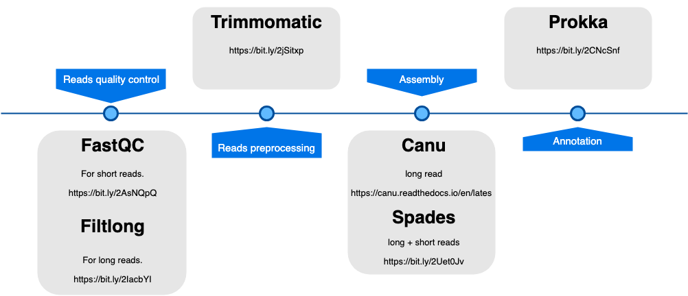

# Project Plan

## Background

The Gram-positive bacterium *Enterococcus faecium* is a commensal of the human gastrointestinal tract and a frequent cause of bloodstream infections in hospitalized patients. The mechanisms by which E. faecium can survive and grow in blood during an infection have not yet been characterized. Here, we identify genes that contribute to growth of E. faecium in human serum through transcriptome profiling (RNA-seq) and a highthroughput transposon mutant library sequencing approach (Tn-seq).

---

## What is the aim of the project? What question are they trying to answer?

This is a exploratory experiment since they are trying to look for drug / treatment targets that could lead to a reduced fitness of the bacteria. 

How come can *E. faecium* grow on human serum (low nutrients)? They try to find out by identifying essential genes in this process by Tn-seq (high throughput sequencing technique for screening). In addition, they determined the transcriptomal response in that environment followed by an analysis of two of the found genes that contribute to growth in serum. 

---

## Type of data

Biological data:

1. *Enterococcus faecium* E745
    -  G+ 
    -  non-hemolytic
    -  commensal
    -  Amp - Vmc resistant

It was extracted form **hospitalized patients**. 

2. *De novo* genome assembly
    - PacBio RS II SMRT long-reads
    - Nanopore MinION R7 long-reads
    - Illumina HiSeq 100 bp pair-end short-reads
        - Corrected PacBio were assembled using Celera 8.1
        - Assembled contigs were corrected with Illumina using BWA 0.7.9a
            - BWA-MEM algorithm
            - -M alignment
        -  5 non-overlapping contigs. These 5 contigs were aligned against the NCBI Genbank database and all were found to be part of the E. faecium plasmid pMG1 A single gap between two contigs, could not be closed by PCR. Thus, we assembled Illumina reads together with MinION 2D reads using the SPAdes assembler (version 3.0)
        - 3095 CDS
        - Sequence coverage was  determined with SAMtools 0.1.18 using short-reads to the assembly using BWA 0.7.9a
        - Base-calling and assembly errors using SAMtools aligning short reads
        - Genome annotation using Prokka 1.10
            - The chromosome contains a pathogenicity island encoding *esp*, as expected in the A-1 clade
        - Identify antibiotic resistance genes with ResFinder
            - *vanA*, vancomycin resistance carried on pE745-2
            - *dfrG*, pE745-6
            - *msrC*, chromosome

3. Phylogenetic Analysis

They want to prove that the strain they are analyzing (E745) is part of the A-1 clade. This clade exclusively contains genetic elements that are absent from animal or human commensal isolates and which contribute to gut colonization and pathogenicity. 

3. RNA-seq
    - Strand-specific library generation with ScriptSeq
        > What is a strand-specific library?
    - Illumina HiSeq 2500 100 bp pair-end sequence amplified RNA-seq libraries were aligned to the genome
        + 3217 transcription units identified, including 651 operons
        + 860 (q<0.001 and fold >2 or <0.5) different expression between conditions
        + among those there's a cluster in purin biosynthesis (DNA)
        + verification using qRT-PCR (r2 = 0.98)
    - Three replicates
    * Data analysis using Rockhopper with strand specific analysis

4. Tn-seq
    > What is it? Basically purification of genomic DNA from a pooled population of mutants, cleavage of the DNA (using either specific enzymes or random shearing), attachment of one or more adaptors to the DNA fragments to facilitate PCR amplification of the fragments contain- ing transposon sequences, and finally, MPS of the amplified fragments to determine the location of the transposon and the relative abundance of mutants containing a transposon at this site.
    - What genes are essential for growth in general medium?
    
        - 10 replicates of mutant library grown in general medium.
        - DNA extraction
        - Tn-seq
        - sequence reads mapped to the genome
        - read-counts were tailed for essentiality
        
    - What genes are essential for growth in serum?
        - grown in general medium and serum (heat inactivated)
        - same procedure as before
        - triplicate

Tn-seq samples were sequenced (50 nt, single-end) on one lane of a Illumina Hiseq 2500 generating an average of 15 million high quality reads per sample.

* Reads were split using Galaxy according to their barcode
* fragments of 16 nt of each read were mapped to the genome using Bowtie 2
* results sorted and counter by IGV using 25nt window size (110,601). 
* 49,984 contained one or more seq reads
* no positional bias in the tranposon insertion sites
* the transposons mapping to the genome will be from the bacteria that survived, meaning that the gene mapped is not essential
* Read counts (15 mill for each library) normalized RPKM -> statistical analysis with Cyber-T
* p-value (BH) < 0.05 and >2 abundance in transposon between general and serium medium -> genes contributing to growth in human serum.
* 37 genes contributed to growth of E745 in human serum -> multifactorial process
* fold change between BHI/Serum -> if theres 100 fold means that the mutant in that mapped gene is not required un BHI but it is on Serum -> possible target

---

## Metadata

_Genome assembly_

[Assembly metadata](https://github.com/Slakky/stunning-garbanzo/blob/master/data/metadata/12864_2017_4299_MOESM1_ESM.csv)

| Plasmid name | Size (bp) | Sequence coverage | Accession number |
|:------------:|:---------:|:-----------------:|:----------------:|
|  Chromosome  |  2765010  |       85,74       |     CP014529     |
|    pE745-1   |   223688  |       99,69       |     CP014530     |
|    pE745-2   |   32423   |       340,23      |     CP014531     |
|    pE745-3   |    9310   |       396,93      |     CP014532     |
|    pE745-4   |   17254   |       81,08       |     CP014533     |
|    pE745-5   |   55167   |       166,16      |     CP014534     |
|    pE745-6   |   65558   |       176,04      |     CP014535     |

_RNA-seq_

[Differentially expressed genes](https://github.com/Slakky/stunning-garbanzo/blob/master/data/metadata/12864_2017_4299_MOESM4_ESM.csv)

| Synonym       | Chromosome/Plasmid | Name   | Product                                             | Fold HSerum/BHI RNA-Seqa | q HSerum/BHI RNA-Seqb | 
|---------------|--------------------|--------|-----------------------------------------------------|--------------------------|-----------------------| 
| EfmE745_01939 | Chromosome         | purL   | Phosphoribosylformylglycinamidine synthase 2        | 422,56                   | 0                     | 
| EfmE745_01937 | Chromosome         | purM   | Phosphoribosylformylglycinamidine cyclo-ligase      | 322,70                   | 0                     | 
| EfmE745_01935 | Chromosome         | purH   | Bifunctional purine biosynthesis protein PurH       | 287,82                   | 0                     | 
| EfmE745_01934 | Chromosome         | purD   | Phosphoribosylamine--glycine ligase                 | 266,60                   | 0                     | 
| EfmE745_01936 | Chromosome         | purN   | Phosphoribosylglycinamide formyltransferase         | 260,33                   | 0                     | 
| EfmE745_01881 | Chromosome         | -      | hypothetical protein                                | 202,95                   | 0                     | 
| EfmE745_01665 | Chromosome         | gspA_2 | General stress protein A                            | 197,50                   | 0                     | 
| EfmE745_01664 | Chromosome         | gspA_1 | General stress protein A                            | 196,00                   | 0                     | 
| EfmE745_01667 | Chromosome         | corA_2 | Magnesium transport protein CorA                    | 175,33                   | 0                     | 
| EfmE745_00732 | Chromosome         | chbC   | N,N'-diacetylchitobiose permease IIC component      | 173,50                   | 0                     | 
| EfmE745_00882 | Chromosome         | dppE   | Dipeptide-binding protein DppE precursor            | 144,79                   | 0                     | 
| EfmE745_00884 | Chromosome         | oppB   | Oligopeptide transport system permease protein OppB | 144,38                   | 0                     | 

>it cotinues...

_Tn-seq_

[Genes contributing to growth in human serum](https://github.com/Slakky/stunning-garbanzo/blob/master/data/metadata/12864_2017_4299_MOESM8_ESM.csv)

| Synonym       | Chromosome/Plasmid | Name   | Product                                                       | fold change BHI/HSerum Tn-seqa | q BHI/HSerum_Tn-seqb | 
|---------------|--------------------|--------|---------------------------------------------------------------|--------------------------------|----------------------| 
| EfmE745_00013 | Chromosome         | purA   | Adenylosuccinate synthetase                                   | >100                           | 3,04E-05             | 
| EfmE745_01785 | Chromosome         | pyrF   | Orotidine 5'-phosphate decarboxylase                          | >100                           | 2,27E-03             | 
| EfmE745_01958 | Chromosome         | -      | hypothetical protein                                          | >100                           | 9,63E-03             | 
| EfmE745_00690 | Chromosome         | manY_2 | Mannose permease IIC component                                | 77,76                          | 1,71E-10             | 
| EfmE745_01942 | Chromosome         | purC   | Phosphoribosylaminoimidazole-succinocarboxamide synthase      | 54,05                          | 0,01                 | 
| EfmE745_00691 | Chromosome         | manZ_3 | Mannose permease IID component                                | 37,70                          | 9,16E-11             | 
| EfmE745_00687 | Chromosome         | algB   | Alginate biosynthesis transcriptional regulatory protein AlgB | 32,74                          | 1,33E-06             | 

>it continues...

## Time consuming steps

For time consuming steps, use the following config file:

```
#!/bin/bash -l
#SBATCH -A g2019003
#SBATCH -p core
#SBATCH -n 2
#SBATCH -t 00:00:00
#SBATCH -J job_name
#SBATCH --mail-type=ALL
#SBATCH --mail-user your_email
# Load modules
module load bioinfo-tools
module load ....
# Your commands
<Command_1...>
<Command_2...>
```

With the following options:
- -n (number of cores). This does not substitute the option from the software
- -t (dd-hh:mm:ss)
- -J job's name
- -mail-user 

```console
$sbatch sbatch_script.sh
```


---

## Diagram


### General assembly workflow

<center><b>Workflow</b></center>></p>

<p align="center">
    
</p>


<center><b>Tools</b></center>></p>

<p align="center">
    
</p>


---

## What can we download?

What is the accession number -> SRA archive -> find the reads. -> unzip it to FASTQ files

## Steps for analysis

1. Check read quality with FASTQC. 
    
    Get rid of bad reads and trim the tail of the read that is not good enough.

    3 thousand CDS. 

    How to run FASTQC with all the different types of data. 

2. Filter the reads

    Tool for filtering the reads -> trimomatic

3. Genome assembly 

    - PacBio -> Celera
    - Nanopore -> MaSURCa
    - Illumina HiSeq -> Spades

4.  Genome assembly quality checking

Find software to do so 

5. Compare genome assemblies and their qualities 

6. Synteny, look at the genome, does the genes look equally disposed as closely related genomes
7. 

