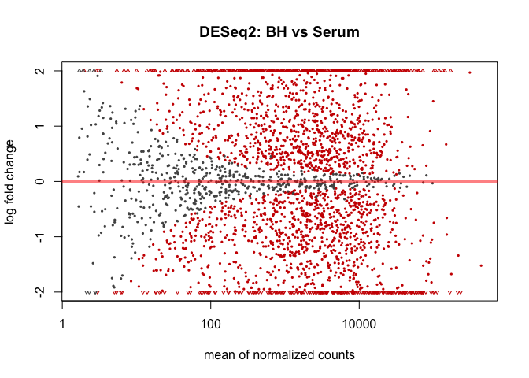
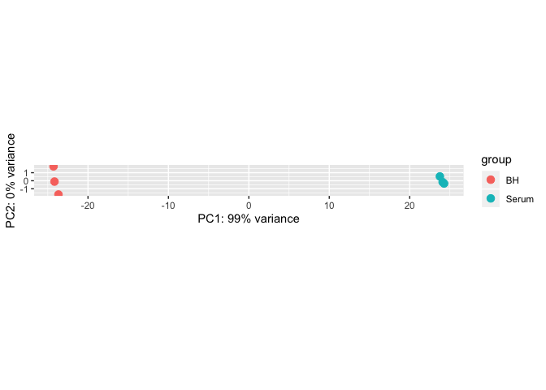
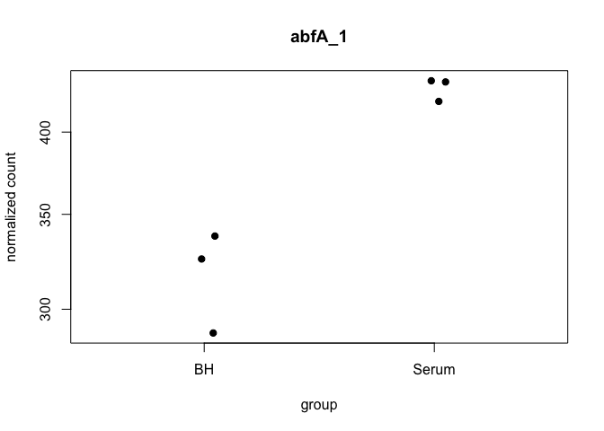
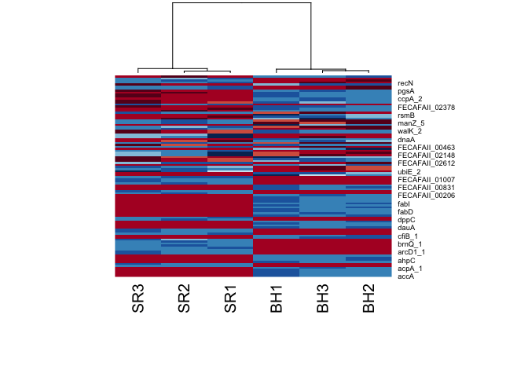
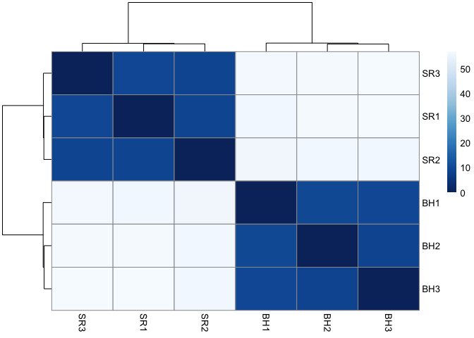

Notebook
================

### Loading needed libraries

``` r
library("DESeq2")
library("IHW")
library('ggplot2')
library('regionReport')
library("RColorBrewer") 
library("pheatmap")
```

### Tidying up the data

``` r
counts = read.delim("~/MScBioinformatics/Period4/GA/stunning-garbanzo/results/transcriptomics/Counts/htseq_all_sample_count.tsv", header=F, row.names=1)
numc <- sapply(counts, is.factor)
counts[numc] <- lapply(counts[numc], function(x) as.numeric(as.character(x)))
counts <- na.omit(counts)
colnames(counts) = c("BH1", "SR1", "BH2", "SR2", "BH3", "SR3")
my.design <- data.frame(
  row.names = colnames( counts ),
  condition = c( "BH", "Serum", "BH", "Serum","BH", "Serum"),
  libType = c( "paired-end", "paired-end","paired-end","paired-end","paired-end","paired-end" )
)
conds <- factor(my.design$condition)
dds <- DESeqDataSetFromMatrix(countData = counts, colData = my.design, design = ~ condition)
featureData <- data.frame(gene=rownames(counts))
mcols(dds) <- DataFrame(mcols(dds), featureData)
```

### Pre-Filtering for reads with at least 10 counts

``` r
keep <- rowSums(counts(dds)) >= 10
dds <- dds[keep,]
```

### Refactor control and BH

``` r
dds$condition <- relevel(dds$condition, ref = "BH")
```

### Differential Expression analysis

``` r
dds <- DESeq(dds)
res <- results(dds, filterFun = ihw)
resOrdered <- res[order(res$pvalue),]
```

### Top 50 results

``` r
n = 50
topResults <- rbind( resOrdered[ abs(resOrdered[,'log2FoldChange']) > 2, ][1:n,], 
                     resOrdered[ abs(resOrdered[,'log2FoldChange']) < 0.5, ][n:1,] )
topResults[c(1:5,(2*n-4):(2*n)), c('baseMean','log2FoldChange','padj')]
```

    ## log2 fold change (MLE): condition Serum vs BH 
    ##  
    ## DataFrame with 10 rows and 3 columns
    ##                baseMean     log2FoldChange                 padj
    ##               <numeric>          <numeric>            <numeric>
    ## accA   27625.8806052274  -4.88996165510672                    0
    ## accB   23920.3663521394  -5.24823438853975                    0
    ## accD   27612.3236141582  -4.89119155888705                    0
    ## ackA   9391.91342946753  -2.47603032985833                    0
    ## acpA_1 27510.0495552995  -5.73518810450816                    0
    ## gltX   29617.8239150788 -0.486845052975475 3.25897583335763e-18
    ## recN   19251.8737826269  0.455456360576844 8.52403481438372e-19
    ## oatA   32639.7530328186  0.443111668533756   3.729953030687e-19
    ## addA   19701.9466770829  0.473226451973094 3.29204670464235e-19
    ## nagA   12188.5352057524 -0.498635453417903 1.60965021893617e-20

### Plot log fold change vs mean expression for all genes, red = p \< 0.05

``` r
plotMA(resOrdered, main='DESeq2: BH vs Serum', ylim=c(-2,2), alpha = 0.05)
```

<!-- -->

### PCA

``` r
rld <- rlogTransformation(dds, blind=TRUE)
plotPCA(rld)
```

<!-- -->

### Plot count for the best gene (lowest pval)

``` r
plotCounts(dds, gene=which.min(resOrdered$padj), intgroup='condition', pch = 19 )
```

<!-- -->

### Top genes normalized counts heatmap

``` r
hmcol <- brewer.pal(11,'RdBu')
nCounts <- counts(dds, normalized=TRUE)
heatmap(as.matrix(nCounts[ row.names(topResults), ]), Rowv = NA, col = hmcol, mar = c(8,2))
```

<!-- -->

### Sample-to-sample euclidian distance plot

``` r
sampleDists <- dist(t(assay(rld)))
sampleDistMatrix <- as.matrix(sampleDists)
pheatmap(sampleDistMatrix, clustering_distance_rows = sampleDists,
    clustering_distance_cols = sampleDists, color = colorRampPalette( rev(brewer.pal(9, "Blues")) )(255))
```

<!-- -->

### ¿How many genes have a padj value smaller than 0.001?

``` r
filterL2FCG2L05 <- (abs(resOrdered$log2FoldChange) > 2) | (abs(resOrdered$log2FoldChange) < 0.5)
filtered_res <- resOrdered[filterL2FCG2L05,]
sum(filtered_res$padj < 0.001, na.rm=TRUE)
```

    ## [1] 802
